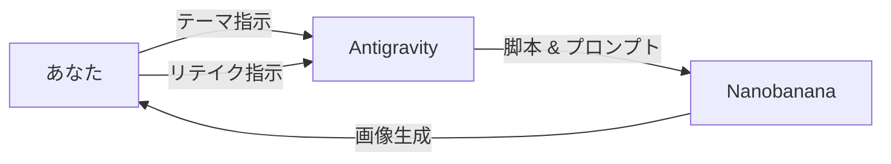

# 🍌 Antigravity & Nanobanana 漫画制作レポート

## 🔰【導入編】最強のタッグ結成

### 1-1. はじめに：なぜこのタッグなのか？

漫画制作は孤独な作業……ではありません。
このプロジェクトでは、以下の強力なチームで制作を進めています。

- **🧠 Antigravity (AIアシスタント)**: 脚本、構成、プロンプト生成担当。論理的で冷静な参謀。
- **🎨 Nanobanana (画像生成エンジン/Manga)**: 圧倒的なビジュアル生成力を持つアーティスト。
- **🧑‍🎨 あなた (監督/総指揮)**: 方向性を決定し、最終的なジャッジを下すクリエイター。

この3者が連携することで、**「投資」という難しいテーマを、魅力的なキャラクタードラマとして描く**ことが可能になります。

### 1-2. ワークフロー概要

1. **指示 (Directive)**: 「複利について描きたい」と伝える。
2. **構築 (Structure)**: Antigravityが4ページの起承転結を組み上げる。
3. **生成 (Generation)**: Nanobananaがその構成をビジュアル化する。
4. **統合 (Integration)**: 生成された画像を漫画形式にまとめ上げる。

### 1-3. 最初の壁：一貫性の維持

AI漫画の最大の課題は、「キャラが安定しないこと」です。
次の章【設定編】では、レミと優斗の姿を固定するための**「鉄壁の呪文 (Visual Lock)」**について解説します。

*(ここにあなたの作業風景やツールのスクリーンショットを貼ると臨場感が出ます)*
